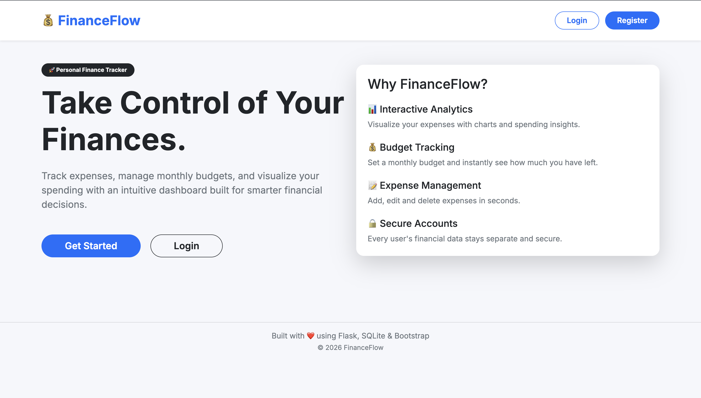
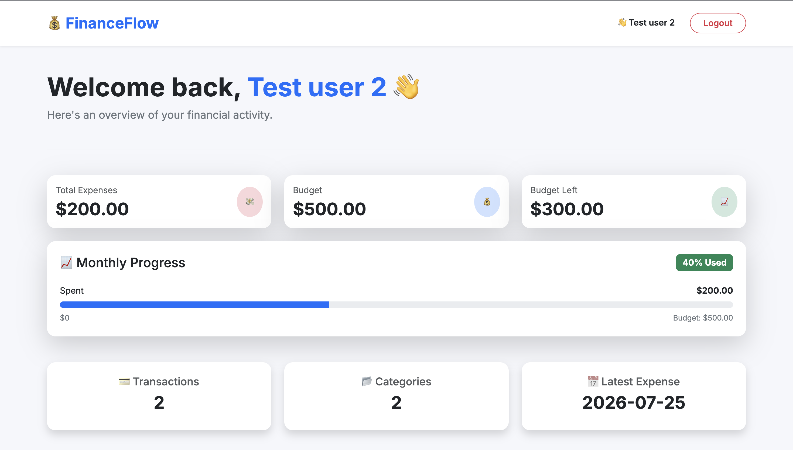
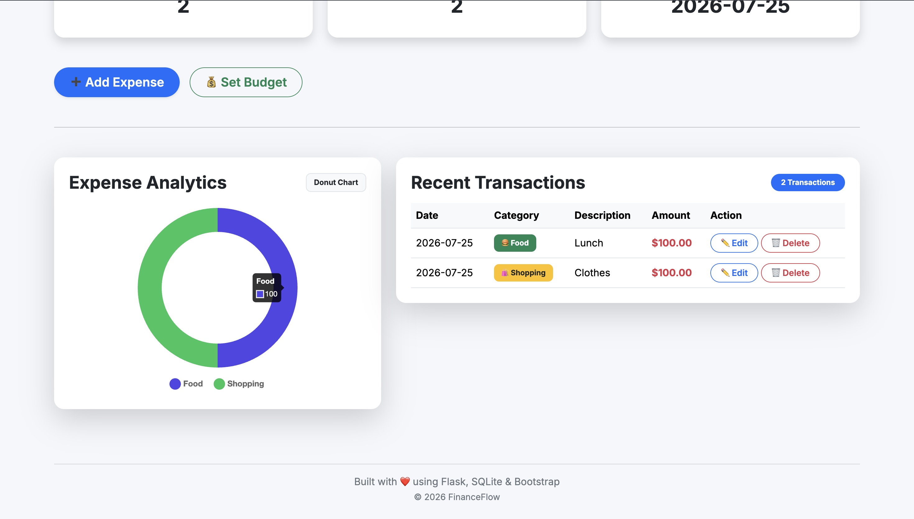
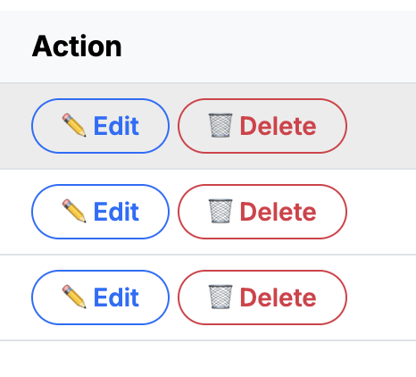

# 💰 FinanceFlow

FinanceFlow is a personal finance tracker built with Flask that helps users manage expenses, set budgets, and visualize spending habits through an interactive dashboard.

---

## 🚀 Features

- 🔐 User Authentication (Register & Login)
- 💸 Add, Edit, and Delete Expenses
- 💰 Monthly Budget Management
- 📊 Interactive Spending Analytics
- 📈 Daily Expense Trends
- 🥧 Category-wise Spending Breakdown
- 📉 Budget Progress Tracker
- 🎨 Responsive Bootstrap 5 Interface

---

## 🛠 Tech Stack

- Python
- Flask
- SQLite
- HTML
- CSS
- Bootstrap 5
- JavaScript
- Chart.js

---

## 📷 Screenshots

### Landing Page



### Dashboard




### Add Expense


### Edit Expense



---

## ⚙ Installation

```bash
git clone https://github.com/YOUR_USERNAME/FinanceFlow.git

cd FinanceFlow

pip install -r requirements.txt

python init_db.py

python app.py
```